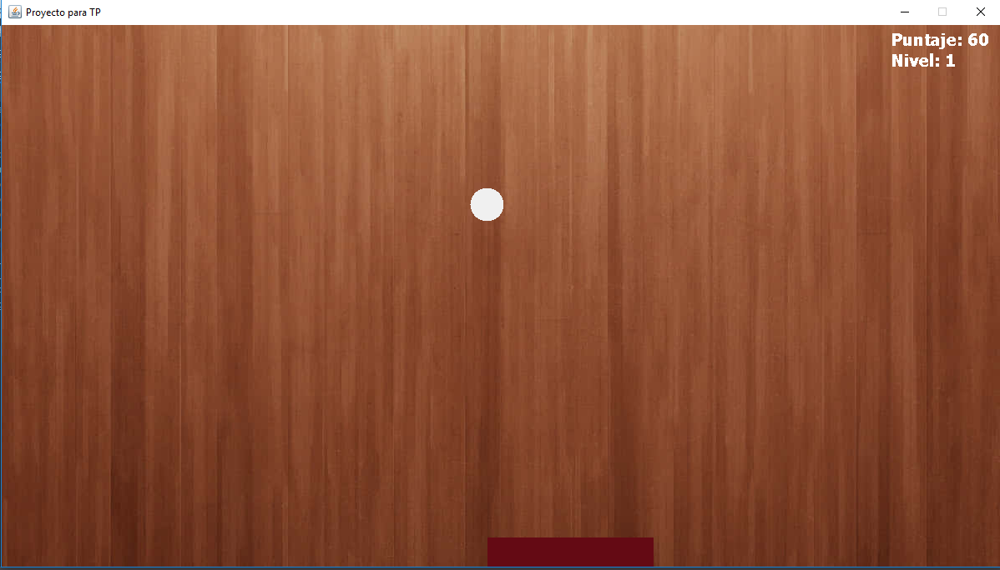

# Juego Barra

## Descripción

Juego desarrollado en Java como trabajo práctico de la materia Programación II.

El objetivo del juego es mantener la pelota en movimiento utilizando una barra controlada por el jugador. Cada vez que la pelota rebota en la barra continúa su recorrido, mientras que si cae por debajo de ella la partida finaliza (Game Over).

El juego incluye un sistema de puntajes y niveles, aumentando progresivamente la dificultad a medida que el jugador avanza.

## Integrantes

- Carlos Alberto Iturri

## Tecnologías utilizadas

- Java
- Eclipse IDE

## Cómo ejecutar el proyecto

1. Abrir el proyecto en Eclipse.
2. Ejecutar la clase `Juego.java`.
3. Disfrutar del juego.

## Características

- Movimiento de la barra controlado por el jugador.
- Rebote de la pelota.
- Sistema de puntajes.
- Niveles de dificultad.
- Pantalla de Game Over.
